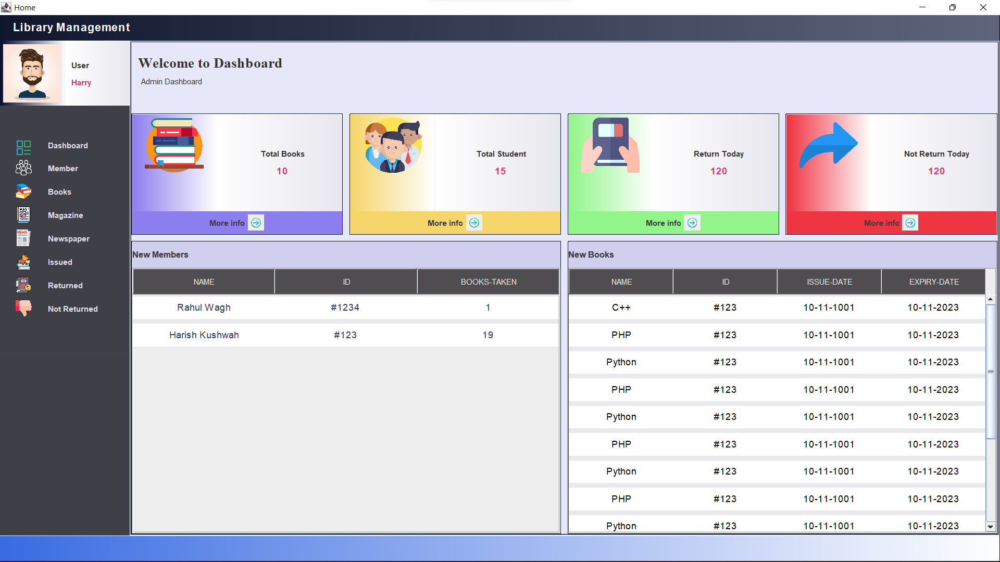

# Library Management System


A simple Library Management System created using Java Swing.

## Table of Contents

- [Features](#features)
- [Screenshots](#screenshots)
- [Installation](#installation)
- [Usage](#usage)
- [Contributing](#contributing)
- [License](#license)

## Features

- Add, edit, and delete books from the library.
- Track loaned books and due dates.
- Search for books by title, author, or category.
- User authentication for librarians and patrons.

## Screenshots




## Installation

1. Clone the repository:

   ```shell
   git clone https://github.com/yourusername/library-management-system.git
   ```

2. Compile the Java source code:

   ```shell
   javac -cp .:./path/to/swing-library.jar Main.java
   ```

3. Run the application:

   ```shell
   java -cp .:./path/to/swing-library.jar Main
   ```

## Usage

1. Start the application by following the installation instructions.
2. Log in as a librarian or a patron.
3. Use the application to manage and search for books.

## Contributing

Contributions are welcome! Please follow these steps:

1. Fork the repository.
2. Create a new branch for your feature or bug fix.
3. Make your changes and commit them.
4. Push to your fork and submit a pull request.

## License

This project is licensed under the MIT License - see the [LICENSE](LICENSE) file for details.

---

Happy coding!

For any questions or issues, please contact [Rupesh Kakade](mailto:rupeshkakade2003@gmail.com).
